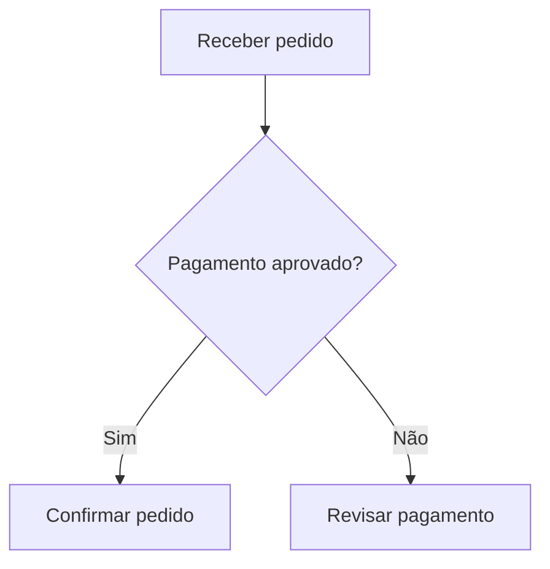
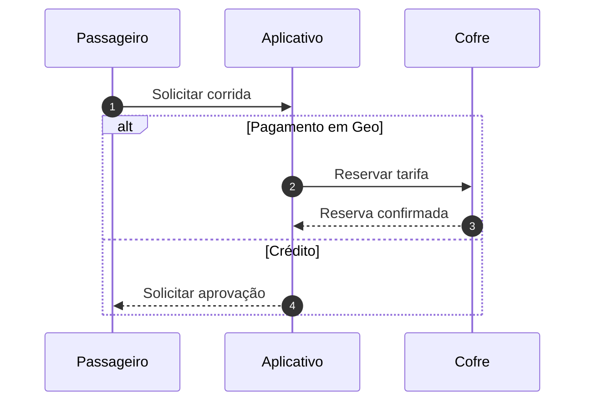

# Visualização e Mermaid de origem

## O que funcionou no exemplo recebido

O arquivo publicado `02_Regras_de_Negocio_v2.0.1_Diagrama_01` contém 28 formas, oito decisões e 26 conexões. Há dois componentes independentes, sem raias e sem ciclos. O conjunto ocupa aproximadamente 866 × 2.907 unidades do quadro.

As etapas principais avançam de cima para baixo. As decisões abrem ramificações locais para rejeição, bloqueio ou contingência. A quantidade de ligações entre partes distantes é baixa. Isso permite uma composição com largura contida e sem um corredor horizontal muito extenso.

A distribuição resolve a orientação, mas o ajuste para mostrar tudo reduz o exemplo para cerca de 25% na janela de teste. A leitura continua dependendo do botão 1:1, rolagem e minimapa. O rótulo “Geo pré-bloqueado ou crédito aprovado” é longo para uma seta. Os dois processos independentes poderiam ter nomes e pontos de entrada próprios. A cópia publicada contém itens convertidos, sem o Mermaid original; essas conclusões derivam da estrutura salva, e não de uma comparação com o código de origem.

O segundo exemplo contém sete participantes, 15 mensagens e uma alternativa `alt/else` de pagamento. A ordem temporal e a identidade dos participantes precisam ser mantidas. Reorganizar esse conteúdo como um fluxo de passos perderia a convenção de leitura de sequências.

## Entregue nesta mudança

- Modelo nativo para `sequenceDiagram`: participantes, mensagens, respostas pontilhadas, chamadas ao próprio participante, notas, numeração, ativações e blocos loop/alt/opt/par/critical/break/rect.
- Editor de nomes, conteúdo, origem/destino e tipo das mensagens; inserção, remoção, reordenação e criação de notas, alternativas e loops.
- Fluxogramas continuam usando ELK e suas formas editáveis. A composição temporal de sequência usa um mecanismo próprio.
- A versão Mermaid é fixada em 11.12.0 para manter previsibilidade entre navegador e servidor.
- O algoritmo de organização tenta um segundo método de quebra de ciclos quando ELK falha em um grupo com ciclo e uma ligação para fora do grupo.
- SVG e PNG com recorte do conteúdo, fundo branco/transparente e opção de quadro completo, fase ou visão geral por fases.
- Ferramenta MCP `export_diagram` e endpoint de download. O servidor converte código de origem em memória sem gravar alterações, inclusive quando o app ainda não abriu o diagrama.

Criação/destruição dinâmica (`create`/`destroy`) e símbolos especializados de participantes ainda precisam de trabalho próprio. Criação/destruição mantém o conteúdo como cartão Mermaid com uma mensagem explicando a limitação da conversão. Símbolos especializados são armazenados no modelo, mas nesta versão usam uma caixa com o nome. Diagramas Mermaid de outros tipos continuam em cartões; a exportação pelo navegador renderiza esses cartões em SVG portátil quando o renderer consegue produzir rótulos sem HTML. O exportador MCP atualmente aceita fluxogramas e sequências de origem.

## Próximas melhorias, em ordem

1. **Leitura por processo e por bloco temporal.** Identificar componentes desconectados e nomear cada processo; em sequências longas, permitir focar uma alternativa ou loop mantendo o contexto dos participantes. Manter a vista completa e a vista resumida.
2. **Texto medido e detalhes sob demanda.** Medir as fontes de fato antes de definir tamanhos, manter o rótulo principal curto, oferecer regras completas em um painel de detalhes e posicionar rótulos com fundo de proteção.
3. **Agrupamento com significado explícito.** Diferenciar fase de processo, responsabilidade e módulo. Uma fase segue a ordem das etapas; uma raia de responsabilidade mantém uma coluna ou faixa por responsável. Não deduzir que todo subgraph representa uma fase.
4. **Qualidade de roteamento.** Reservar espaço para retornos, separar setas paralelas, evitar interseções entre rótulos e ligações, revisar formas de decisão e grupos aninhados. Medir número de cruzamentos, comprimento de retorno e sobreposição de texto.
5. **Escala e desempenho.** Testar 50/150/500 etapas e sequências com muitos participantes; desenhar apenas a região visível quando necessário, organizar fora da thread principal e guardar resultados por versão da geometria. Usar SVG como formato de compartilhamento para conteúdos grandes.
6. **Compatibilidade comercial.** Repetir o mesmo conjunto de testes nas versões do usuário de Comet, Chrome e Edge, com painéis laterais e zoom do navegador. Os testes automatizados em Chromium cobrem comportamento e geometria; não equivalem a essa conferência.

## Boas práticas para quem gera o Mermaid

### Fluxogramas

- Usar `flowchart TD` para processos que avançam no tempo. Usar LR quando a estrutura tem poucos níveis e a leitura horizontal faz sentido.
- Dar a cada etapa um ID estável (`validar_pagamento`) e um rótulo curto (`Validar pagamento`). Separar identificação de texto apresentado.
- Colocar aspas nos rótulos com parênteses, pontuação ou caracteres especiais: `A["Coletar backup (1)"]`.
- Escrever uma declaração ou conexão por linha.
- Manter textos de decisão como perguntas e rótulos de saída curtos: `Sim`, `Não`, `Aprovado`, `Recusado`. Colocar a explicação extensa em uma nota ou documentação.
- Declarar grupos apenas quando representam uma fase, responsável ou módulo real. Evitar grupos para simples decoração.
- Não depender de `direction` dentro de subgraph como garantia de posicionamento: Mermaid pode ignorar essa direção quando há ligações entre etapas internas e externas.
- Representar retornos reais quando existirem, sem acrescentar ligações só para forçar o layout.
- Evitar parâmetros de tamanho absoluto, HTML, imagens remotas e estilos que dependem do navegador. Preferir os temas do VLI na conversão nativa.
- Dividir a documentação por cenários e manter um resumo com links entre processos quando a rede fica difícil de acompanhar.

### Sequências

- Usar `sequenceDiagram` para colaboração entre participantes ao longo do tempo.
- Declarar os participantes na ordem em que devem aparecer; usar IDs curtos e aliases: `participant A as App StagRide`.
- Usar `->>` para chamadas e `-->>` para respostas quando essa distinção se aplica ao processo.
- Usar `autonumber` quando for útil referenciar mensagens em uma revisão.
- Escrever mensagens curtas, deixando explicações extensas em `Note over`.
- Usar `alt/else/end`, `opt/end` e `loop/end` para representar condições e repetições reais. Evitar aninhamento profundo sem necessidade.
- Criar sequências separadas para cenários diferentes, preservando os IDs dos participantes.
- Não adicionar retornos ou participantes artificiais para mudar a aparência.

Referências oficiais: https://mermaid.js.org/syntax/flowchart.html e https://mermaid.js.org/syntax/sequenceDiagram.html. Os exemplos usam recursos compatíveis com a versão 11.12.0 fixada no projeto. Recursos novos de versões posteriores não são pressupostos.
